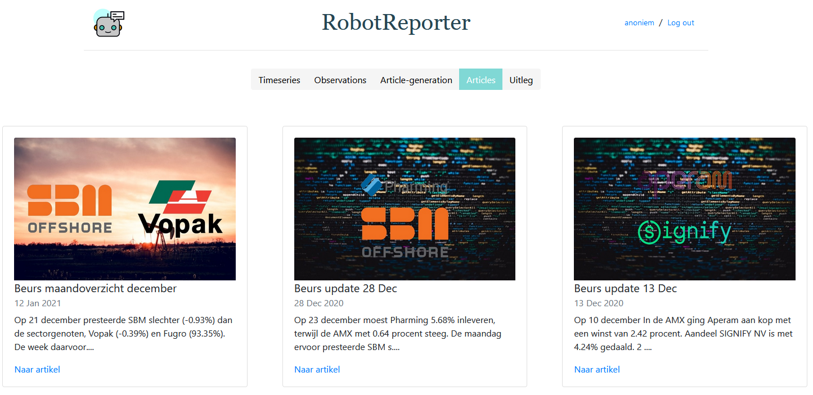
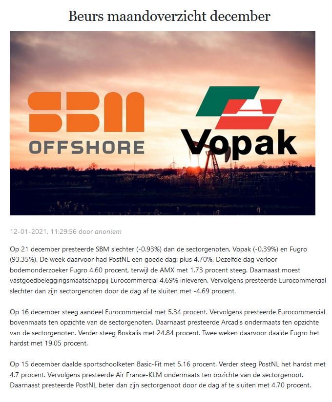
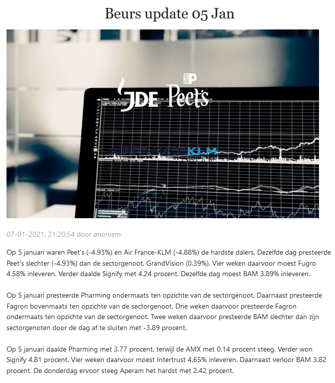

# Robotreporter
Robotreporter is een generatief AI-systeem, dat zelf artikelen schrijft. Het systeem werkt met een combinatie van NLG-technieken om artikelen te maken. Om te demonstreren hoe de de AI werkt, wordt er beursinformatie gebruikt. Het systeem bekijkt het koersverloop van alle aandelen in de Nederlandse AMX-index, en maakt artikelen over deze aandelenkoersen. 

Dit project is een samenwerking tussen [Ict Institute](https://ictinstitute.nl/ "Home ICT Institute") en het [lectoraat Articificial Intelligence](https://www.hu.nl/onderzoek/artificial-intelligence "Home lectoraat") van de Hogeschool Utrecht.

## Gebruik systeem
Bij deze repository wordt zowel een `[requirements.txt]` geleverd alsmede een `[environment.yml]` voor het installeren van de dependencies van deze repo.

Verder is in deze repo een .env.example toegevoegd. Na het clonen van deze repo moeten de environment variabelen die hierin opgeslagen staan ingevuld worden en moet dit bestand opgeslagen worden als een `[.env]` bestand.

Als laatste wordt er zowel in de productie als in development gebruik gemaakt van een postgres database.

### Lokaal installeren
1. `git clone https://github.com/StanMey/Robotreporter`
2. `cd .\Robotreporter\`
3. `conda env create -f environment.yml`
4. `conda activate nieuwsbot_env`
5. `python manage.py migrate`
6. `python manage.py setup_project`
7. `python manage.py runserver`

## over het systeem

### opzet van de website
De website is opgezet en verdeeld in 5 verschillende modules.
Dit valt ook terug te zien in de navigatiebalk.

#### Module timeseries
In deze module zijn alle dagelijkse koersen van alle AMX-aandelen verzameld.
De gebruiker kan door op een aandeel te klikken per data de geschiedenis terugzien.
#### Module observations
In deze module worden alle gevonden observaties weergegeven.
Hier kan de gebruiker filters overheen zetten om de observaties te bekijken.
#### Module article-generation
In deze module kan de gebruiker de settings kiezen die gebruikt worden tijdens de generatie van een nieuw artikel.
#### Module articles
In deze module worden alle gegenereerde artikelen getoond.
#### Module uitleg
In deze module wordt alle uitleg over het systeem en het project weergegeven.

### opzet van de NLGengine module
Voor de opzet van de NLGengine module is voor een modulaire aanpak gekozen.
De code voor het zoeken naar patronen bevinden zich in de _patterns_ folder.
Deze patterns worden aangeroepen vanuit het *analyse.py* bestand.

Binnen de _content\_determination_ folder staat alle code en informatie die nodig is om observaties te selecteren voor in het artikel.
Deze observaties worden ingedeeld in paragrafen en aan de planner doorgegeven in de _microplanning_ folder.
Deze paragrafen worden uiteindelijk doorgegeven aan de Realiser binnen de _realisation_ folder die deze omzet naar het uiteindelijke artikel.

### generatie van afbeelding bij een artikel
Om een afbeelding bij een artikel te genereren wordt gebruik gemaakt van de logo's van de componenten en een achtergrond afbeelding.
Allereerst worden de twee vormen van de logo's met elkaar vergeleken om op basis van de vormen de logo's ofwel naast elkaar ofwel onder elkaar te plaatsen.
Hieronder worden een aantal voorbeelden teruggegeven waar afbeeldingen zijn gegenereerd.

## Meer over Robotreporter
Eén van de doelen van dit project is om mensen op een zo praktisch mogelijke manier zelf AI te laten gebruiken. Het Robotreporter project zelf heeft geen winstoogmerk en het systeem wordt open-source beschikbaar gesteld dankzij de sponsoring door ICT Institute.

## Voorbeelden van gegenereerde artikelen
Hieronder worden twee voorbeelden van gegenereerde artikelen getoond:

## Inspiratie en links
- [De website van RobotReporter](https://www.robotreporter.nl/)
- [Artikel over RobotReporter vanuit ICT Institute](https://softwarezaken.nl/2020/11/robotreporter-transparant-gebruik-ai/)
- [Artikel over Robotreporter vanuit Lectoraat](https://www.hu.nl/onderzoek/projecten/robotreporter-onderzoek-naar-generatieve-ai-systemen)
- [LA times maakt gebruik van _Quakebot_ om zo snel mogelijk een artikel te publiceren wanneer een aardbeving voorkomt](https://www.hu.nl/onderzoek/projecten/robotreporter-onderzoek-naar-generatieve-ai-systemen)
- [Marketwatch gebruikt een algoritme om automatisch aandeel gerelateerde berichten te genereren](https://www.marketwatch.com/author/marketwatch-automation?mod=MW_author_byline)
- [De Universiteit van Tillburg heeft het _PASS_ systeem ontwikkeld om sportartikelen op te stellen gebaseerd op het leespubliek](https://research.tilburguniversity.edu/en/publications/pass-a-dutch-data-to-text-system-for-soccer-targeted-towards-spec)
- [De Washington Post gebruikt _Heliograph_ om korte verslagen van lokale sportwedstrijden te maken](https://www.washingtonpost.com/pr/wp/2017/09/01/the-washington-post-leverages-heliograf-to-cover-high-school-football/)
- [De Universiteit van Northwestern heeft het _StatsMonkey_ ontwikkeld waarmee het sportartikelen kan opstellen door naar de wedstrijddata te kijken](https://www.semanticscholar.org/paper/StatsMonkey%3A-A-Data-Driven-Sports-Narrative-Writer-Allen-Templon/6063b014018b6d2655053f9739613473406ff6df#paper-header)
